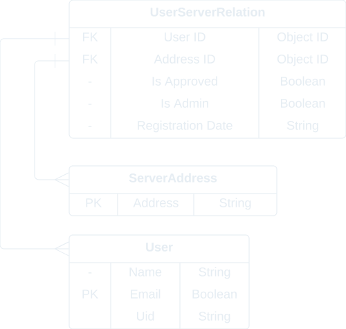

<h1 align="center">
  
</h1>

<br>

<p align="center">
  Backend 시스템은 복잡하고 다양한 작업을 처리하는 무형의 세계입니다.
  <br>
  문득 "이 세계를 눈에 보이는 형태로 표현하면 재미있지 않을까?"라는 생각이 들었습니다.
  <br>
  이 도시에서는 각 서버와 데이터베이스가 건물로 데이터의 흐름과 작업이 도로와 차량으로 표현됩니다.
  <br>
  여러분 만의 Core City를 관찰하며 Backend 시스템의 상태와 성능을 파악해 보세요!
</p>

<br>

<div align="center">
  
</div>

## 언어별 보기

- [한국어](README.ko.md)
- [English](README.md)

## 목차

- [개요](#개요)
- [주요 기능 및 기술 스택](#주요-기능-및-기술-스택)
  - [3D 시각화](#1-3d-시각화)
  - [실시간 모니터링](#2-실시간-모니터링)
  - [다중 사용자 협업](#3-다중-사용자-협업)
- [데모](#데모)
- [도전 및 학습](#도전-및-학습)
  - [데이터 모델링과 관계 설정](#data-modeling-and-relationship-setting)
  - [Prometheus와 node_exporter 이해 및 사용](#understanding-and-using-prometheus-and-node-exporter)
  - [RESTful API 설계](#designing-restful-api)
  - [클라이언트 사이드에서의 사용자 인증 정보 및 토큰 관리](#managing-authentication-info-and-tokens-on-client-side)
  - [Three.js를 이용한 서버 모니터링 데이터 시각화](#threejs-server-monitoring-visualization)
  - [프로덕션 환경에서의 AWS 배포 및 설정](#aws-deployment-and-configuration-in-production)
- [결과 및 성과](#결과-및-성과)
- [설치 및 실행 지침](#설치-및-실행-지침)
  - [프론트엔드](#installation-frontend)
  - [백엔드](#installation-backend)

## 개요

**배경**:

저는 한 IT회사에서 서버 모니터링 업무를 담당했던 경험이 있습니다. 당시 미술학도였던 저에게 서버나 데이터베이스와 같은 기술 용어는 낯설었습니다. 업무는 비교적 단순했습니다. 사무실의 직원들이 퇴근한 뒤 서버가 별문제 없이 잘 작동하는지 확인하는 일이 주 업무였습니다. 이때 사용했던 서버 모니터링 서비스가 업무에 많은 도움을 주었습니다. 물방울이 위에서 아래로 똑똑 떨어지는 애니메이션이었는데 이게 멈추면 저는 서버에 문제가 생겼다는 걸 알 수 있었고 담당자에게 연락할 수 있었습니다.

**프로젝트 목표 및 동기**:

Core City 프로젝트의 주요 목표는 백엔드 시스템의 다양한 정보와 상태를 3D 가상 도시로 시각화함으로써, 개발자뿐만 아니라 비전문가도 시스템의 상태를 직관적으로 이해하고 모니터링할 수 있는 플랫폼을 제공하는 것입니다. 이 프로젝트를 통해, 사용자는 건물의 높이와 도로 위 차량의 순환을 관찰함으로써 서버의 상태와 성능을 한눈에 파악할 수 있게 됩니다. 또한, 실시간 모니터링과 멀티유저 협업 기능을 통해, 팀 단위의 효율적인 시스템 관리와 문제 해결이 가능하도게 하였습니다. 이 프로젝트는 복잡한 기술적 문제를 해결하기 위한 창의적인 접근 방식을 시도하며, 저의 기술적 역량과 문제 해결 능력을 보여주는 포트폴리오로서 중요한 역할을 할 것으로 생각 합니다.

<br>

## 주요 기능 및 기술 스택

Core City 프로젝트는 데이터 시각화와 실시간 데이터 처리를 통해 복잡한 백엔드 시스템을 직관적으로 이해할 수 있는 플랫폼을 제공합니다. 이러한 목표를 달성하기 위해, 프로젝트의 주요 기능을 구현하고 강화하는 데 적합한 기술 스택을 신중하게 선택했습니다. 선택 과정에서는 프로덕션 환경에서의 성능 및 향후 확장성, 개발 효율성 및 생태계 지원, 보안 및 신뢰성, 그리고 사용자 경험 등 여러 중요한 기준들을 고려했습니다. 이 섹션에서는 프로젝트에서 구현된 주요 기능들과, 이러한 기능을 실현하기 위해 선택된 기술들에 대해 소개하고, 각 기술 선택의 배경과 이유를 설명합니다.

### 1. 3D 시각화

**기능 개요**: 서버 인프라를 3D 모델로 표현하여 사용자가 직관적으로 이해할 수 있는 시각화를 제공합니다. 사용자는 건물의 높이와 도로 위 차량의 순환을 통해 서버의 상태와 성능을 쉽게 파악할 수 있습니다.

**사용된 기술**: [Three.js](https://threejs.org/)

**선택 근거**:

-Three.js는 [JavaScript](https://developer.mozilla.org/ko/docs/Web/JavaScript)로 작성된 [WebGL](https://developer.mozilla.org/ko/docs/Web/API/WebGL_API) 기반의 3D 그래픽 라이브러리입니다. **Core City** 프로젝트는 웹 플랫폼에서의 시각화를 목표로 하고, [React](https:/react.dev/)를 이용해 개발되었기 때문에 라이브러리와 프레임워크 사이의 통합 또한 용이하다는 장점이 있습니다.

<br>

### 2. 실시간 모니터링

**기능 개요**: 사용자의 서버 상태와 성능을 실시간으로 모니터링 할 수 있습니다. 사용자 서버의 상태와 성능 문제를 즉각적으로 탐지하고 대응할 수 있게 함으로써, 높은 가용성과 안정성을 보장합니다.

**사용된 기술**: [Socket.IO](https://socket.io/), [Prometheus & node_exporter](https://prometheus.io/), [Chart.js](https://www.chartjs.org/)

**선택 근거**:

-Socket.IO를 활용한 실시간 서버 모니터링은 양방향 통신과 자동 재연결을 통한 높은 신뢰성, 다양한 브라우저 및 장치에서의 호환성과 개발 편의성을 바탕으로 서비스의 안정성과 가용성을 향상합니다다.

-Prometheus와 node_exporter의 조합은 시스템 모니터링과 성능 분석에 있어 강력한 도구를 제공합니다. Prometheus의 시계열 데이터 모델과 PromQL을 통한 복잡한 분석이 가능해지며, node_exporter는 CPU, 메모리, 디스크 사용량 등 시스템의 광범위한 지표를 수집합니다. 이들의 결합은 동적 인프라 환경에서도 뛰어난 서비스 디스커버리와 자동 타깃 업데이트를 가능하게 합니다.

-Chart.js를 활용한 실시간 모니터링 데이터 시각화는 복잡한 성능 지표를 직관적으로 이해할 수 있게 하며, 사용자 상호작용과 뛰어난 호환성을 제공합니다. 가벼움과 높은 커스터마이징 가능성으로 개발자가 유연하게 시스템을 구축하고 관리할 수 있게 해, 실시간 데이터 분석과 모니터링을 효과적으로 지원합니다.

<br>

### 3. 다중 사용자 협업

**기능 개요**: 팀원과 함께 시스템의 상태를 공동으로 모니터링하고 문제를 신속하게 해결할 수 있게 하여, 효율적인 의사결정과 빠른 대응을 가능하게 합니다.

**사용된 기술**: [Firebase Google Authentication](https://firebase.google.com/)

**선택 근거**:

-Firebase Google Authentication을 통해 사용자의 간편한 로그인과 높은 보안성을 제공하며, 사용자 인증 정보를 바탕으로 일반 사용자와 어드민 사용자의 구분 및 팀 개념 도입을 통해 효율적인 권한 관리와 팀 기반 협업을 가능하게 합니다. 이는 실시간 서버 모니터링 시스템에서의 접근성 향상과 구조화된 사용자 관리를 통해 전체 시스템의 생산성을 증대시킵니다.

<br>

## 데모

**데모 사이트**: https://core-city.net/

<br>

<div align="center">
  
  <p><em>3D 모델링과 실시간 모니터링 데모</em></p>
</div>

<br>

<div align="center">
  
  <p><em>다중 사용자 협업 데모</em></p>
</div>

<br>

## 도전 및 학습

Core City 프로젝트를 진행하면서, 저는 다양한 기술적 도전에 직면했고, 이러한 도전을 해결하는 과정에서 수많은 작은 성공과 실패를 경험했습니다. 이 모든 과정을 통해 귀중한 경험을 쌓을 수 있었습니다. 아래는 프로젝트를 진행하며 마주친 여러 도전 중에서도 가장 기억에 남고 의미 있었던 부분에 대한 내용입니다.

<details>
  <summary id="data-modeling-and-relationship-setting">데이터 모델링과 관계 설정</summary>

Core City 프로젝트의 백엔드 개발 과정에서, 사용자 정보(User)와 서버 주소(ServerAddress) 문서를 효과적으로 관리하고, 이들 사이의 관계(UserServerRelation)를 명확히 정의하는 작업은 간단한 데이터 모델만 만들어 보았던 제게 새로운 방식의 모델링을 학습할 수 있는 좋은 기회였습니다. 특히, 문서 간의 관계를 설정하고 관리하는 릴레이션 스키마의 설계는 데이터 무결성과 접근성을 보장하는 핵심 요소였습니다.

<br>

<div align="center">
  
  <p><em>스키마 모델링</em></p>
</div>

<br>

**정규화된 데이터 모델 설계**: 사용자와 서버 주소 간의 관계를 효율적으로 표현하기 위해, 각각의 엔티티를 별도의 스키마로 정의했습니다. 이를 통해 데이터 중복을 최소화하고, 업데이트와 관리의 효율성을 높였습니다.

**관계형 스키마 정의**: UserServerRelation 스키마를 통해 사용자와 서버 주소 간의 다대다(N:N) 관계를 구현했습니다. 이 스키마는 사용자 ID와 서버 주소 ID를 참조하며, 사용자의 승인 상태와 관리자 여부 등 추가적인 관계 정보를 포함하도록 하였습니다.

**데이터 무결성 및 접근성 보장**: MongoDB의 참조(ref)를 사용하여 관계형 데이터를 관리함으로써, 데이터 무결성을 유지하고, 관련 데이터에 대한 쿼리 수행 시 효율성을 보장하였습니다. 또한, populate() 메소드를 사용하여 관계형 쿼리 결과를 쉽게 가져올 수 있도록 설정했습니다.

**보안 및 권한 관리**: UserServerRelation에서는 사용자의 서버 접근 승인 여부와 관리자 권한을 관리함으로써, 애플리케이션의 보안성을 강화했습니다. 이를 통해 사용자가 접근할 수 있는 서버와 수행할 수 있는 작업을 더욱 세밀하게 제어할 수 있었습니다.

데이터 모델링과 관계 설정 경험을 통해, 단순한 스키마 모델링을 넘어 서로 밀접한 연관이 있는 스키마 모델링을 효과적으로 구축할 수 있는 능력을 키웠습니다. 또한, 데이터 무결성의 중요성을 깨달았으며, 초반에 정확하게 설정하는 것이 프로젝트 전체의 로직 수정을 피할 수 있는 핵심 요소임을 깨달았습니다. 이 경험은 프로젝트를 효율적으로 진행하고 유지 보수하는 데 큰 도움이 되었습니다.

</details>

<br>

<details>
  <summary id="understanding-and-using-prometheus-and-node-exporter">Prometheus와 node_exporter 이해 및 사용</summary>

Core City 프로젝트의 실시간 모니터링 시스템을 구축하는 과정에서, 백엔드 서버의 성능 지표를 수집하고 분석하기 위해 Prometheus와 node_exporter의 도입을 결정했습니다. 이 기술들은 강력한 모니터링 기능을 제공하지만, 초기 설정, 메트릭 수집 방법의 이해, 그리고 데이터 쿼리에 있어서 여러 어려움이 있었습니다.

**학습 포인트 및 해결 과정**:

**초기 설정과 구성 이해**: Prometheus와 node_exporter의 초기 설치 및 구성 과정은 다소 복잡했습니다. 공식 문서와 커뮤니티 가이드를 참조하여, 필요한 소프트웨어의 설치 및 실행 방법을 숙지했습니다. 특히, Prometheus 서버의 구성 파일(`prometheus.yml`) 설정을 통해, 어떤 데이터를 수집할지, 얼마나 자주 수집할지 등을 정의하는 방법을 배웠습니다.

```yml
global:
  scrape_interval: 10s # Set the scrape interval to every 15 seconds. Default is every 1 minute.
  evaluation_interval: 10s # Evaluate rules every 15 seconds. The default is every 1 minute.
  # scrape_timeout is set to the global default (10s).
```

_기본 설정은 15초지만 프로젝트 취지에 맞게 스크랩과 평가 간격을 10초로 조정_

```yml
scrape_configs:
  # The job name is added as a label `job=<job_name>` to any timeseries scraped from this config.
  - job_name: "prometheus"

    # metrics_path defaults to '/metrics'
    # scheme defaults to 'http'.

    static_configs:
      - targets: ["localhost:9100"]
        labels:
          group: "server-monitor"
```

_`prometheus.yml`의 내용 중 스크랩 대상을 node_exporter가 작동하고 있는 9100포트로 재설정 및 그룹 이름 지정_

**메트릭 수집 방법의 이해**: node_exporter를 통해 서버의 다양한 성능 지표(CPU 사용량, 메모리 사용량, 디스크 I/O 등)를 수집하는 방법을 이해하는 데 시간이 걸렸습니다. Prometheus의 메트릭 수집 메커니즘과 node_exporter가 제공하는 메트릭 종류를 학습함으로써, 필요한 성능 지표를 효과적으로 모니터링할 방법을 개발했습니다.

```javascript
const totalMemoryQuery =
  address === "http://localhost:9090/"
    ? `node_memory_total_bytes`
    : `node_memory_MemTotal_bytes`;
const memoryUsedQuery =
  address === "http://localhost:9090/"
    ? `(node_memory_total_bytes - node_memory_free_bytes) / node_memory_total_bytes * 100`
    : `(node_memory_MemTotal_bytes - node_memory_MemFree_bytes) / node_memory_MemTotal_bytes * 100`;
const swapUsedQuery =
  address === "http://localhost:9090/"
    ? `node_memory_swap_used_bytes`
    : `node_memory_SwapTotal_bytes - node_memory_SwapFree_bytes`;
const memoryFreeQuery =
  address === "http://localhost:9090/"
    ? `node_memory_free_bytes`
    : `node_memory_MemFree_bytes`;
```

_프로젝트의 백엔드에서 사용하는 Memory 데이터 수집 관련 쿼리 (예시에서는 개발 환경이거나 프로덕션 환경에 따라 쿼리가 달라지는 것을 고려함)_

**PromQL**: Prometheus의 쿼리 언어인 PromQL을 사용하여, 수집된 데이터에서 유용한 정보를 추출하고 분석하는 방법을 배우는 과정은 특히 도전적이었습니다. 여러 PromQL 예제와 문서를 통해 기본 쿼리 방법을 익히고, 프로젝트의 요구 사항에 맞는 복잡한 쿼리를 작성하는 방법을 학습했습니다.

이러한 도전 과정을 통해, Prometheus와 node_exporter를 사용한 성능 모니터링 시스템의 구축 능력뿐만 아니라, 시스템 성능 분석과 관련된 심층적인 이해를 얻을 수 있었습니다. 이 경험은 프론트엔드와 백엔드 개발을 넘어서 시스템 모니터링과 성능 최적화에 대한 지식과 기술을 쌓는 데 큰 도움이 되었습니다.

</details>

<br>

<details>
  <summary id="designing-restful-api">RESTful API 설계</summary>

Core City 프로젝트의 실시간 데이터 처리 및 다중 사용자 협업 기능을 지원하기 위해서는, 백엔드 시스템과의 효율적인 데이터 교환을 위한 RESTful API의 설계가 필수적이었습니다. RESTful API를 설계하는 과정에서는, 데이터 리소스의 표현, 클라이언트와 서버 간의 상태 전송, 그리고 API 버전 관리 등 여러 가지 난해한 문제들을 해결해야 했습니다.

**학습 포인트 및 해결 과정**:

**리소스 설계와 URI 구조**: 가장 먼저, 서버 상태 정보, 사용자 인증 데이터, 시각화 설정 등 프로젝트에서 다루는 주요 데이터 리소스를 식별했습니다. 각 리소스에 대해 의미론적으로 명확하고, 일관된 URI 구조를 설계함으로써, API의 사용성과 이해도를 높였습니다.

**HTTP 메소드와 상태 코드의 적절한 사용**: 각 API 엔드포인트에서는, 리소스를 생성, 조회, 수정, 삭제하는 CRUD 연산을 수행하기 위해 HTTP 메소드(GET, POST, PUT, DELETE)를 적절히 사용했습니다. 또한, 요청 처리 결과를 명확히 표현하기 위해 HTTP 상태 코드(예: 200 OK, 404 Not Found, 500 Internal Server Error)를 활용하여, 클라이언트에게 API 호출 결과를 정확히 전달했습니다.

**버전 관리**: API의 지속적인 개선과 확장을 위해 URI 경로에 버전 번호를 포함해, 이전 버전의 API를 계속해서 지원하면서도 새로운 기능을 추가할 수 있는 유연성을 확보했습니다.

**보안과 인증**: RESTful API를 통한 데이터 전송 과정에서 보안은 매우 중요한 고려 사항이었습니다. Firebase와 Google Authentication을 활용한 인증 미들웨어를 통해 사용자 인증과 권한 부여를 관리함으로써, 데이터의 안전한 전송과 접근 제어를 구현했습니다.

이러한 과정을 통해, Core City 프로젝트의 핵심 기능을 지원하는 견고하고 확장할 수 있는 RESTful API를 설계하고 구현할 수 있었습니다. RESTful API 설계 과정은 저에게 REST 아키텍처 원칙에 대한 심층적인 이해와 함께, 보다 나은 API 설계 및 보안 전략을 고안하는 능력을 키워주었습니다.

</details>

<br>

<details>
  <summary id="managing-authentication-info-and-tokens-on-client-side">클라이언트 사이드에서의 사용자 인증 정보 및 토큰 관리</summary>

Core City 프로젝트에서, 클라이언트 사이드에서 사용자 인증 정보와 토큰을 안전하게 유지하고 관리하는 것은 큰 도전이었습니다. 특히, 애플리케이션의 상태를 전역적으로 관리하면서도 보안을 유지해야 하는 필요성이 있었습니다. 사용자 인증 상태를 효과적으로 관리하고, 서버와의 인증 토큰을 이용한 통신이 안전하게 이루어질 수 있도록 하는 것이 주요 과제였습니다.

**학습 포인트 및 해결 과정**:

**리덕스를 이용한 상태 관리**: 리덕스를 통해 애플리케이션의 다양한 컴포넌트에서 사용자 인증 상태를 중앙에서 관리할 수 있도록 했습니다. 이를 통해, 애플리케이션 내 어디서든 인증 상태에 접근하고 업데이트할 수 있는 구조를 마련했습니다.

```javascript
import useAuthState from "@/hooks/useAuthState";

function App() {
  useAuthState();
  .
  .
  .
}
```

**커스텀 훅의 사용**: 리액트의 커스텀 훅 기능을 이용하여, 인증 토큰의 저장, 갱신, 삭제와 같은 로직을 재사용할 수 있는 형태로 구현했습니다. 이 커스텀 훅은 인증 과정에서 발생할 수 있는 다양한 시나리오를 처리하는 데 중심 역할을 했습니다.

```javascript
const useAuthState = () => {
  const auth = getAuth(app);
  const dispatch = useDispatch();

  useEffect(() => {
    const unsubscribe = auth.onAuthStateChanged(async (user) => {
      if (!user) {
        dispatch(clearUser());

        return;
      }

      const token = await user.getIdToken();
      const result = await getUserInformation(token);

      if (result.error) {
        console.error(result.error);

        return;
      }

      dispatch(
        setUser({
          id: result._id,
          email: result.email,
          name: result.name,
          uid: result.uid,
          token: token,
        }),
      );
    });

    return () => unsubscribe();
  }, [dispatch]);
};
```

**앱 초기화 시 인증 상태 확인**: `App.jsx`에서 애플리케이션 초기화 시점에 사용자 인증 정보와 토큰의 유효성을 검증하는 로직을 구현했습니다. 이를 통해, 사용자가 애플리케이션에 접근할 때마다 인증 상태가 최신 상태로 유지되도록 했습니다.

**보안성 강화**: 사용자 인증 정보와 토큰을 클라이언트 사이드에서 안전하게 관리하기 위해, HTTPS를 통한 암호화된 통신, 토큰 기반 인증 방식 등의 보안 베스트 프랙티스를 적용했습니다.

이러한 접근 방식은 사용자 인증 정보와 토큰을 효율적으로 관리하면서도, 보안을 강화할 수 있는 효과적인 해결책이었습니다. 클라이언트 사이드에서의 인증 정보 관리는 복잡할 수 있지만, 리덕스와 커스텀 훅을 활용함으로써 이러한 복잡성을 해결하고, 사용자 인증 과정을 원활하게 관리할 수 있었습니다.

</details>

<br>

<details>
  <summary id="threejs-server-monitoring-visualization">Three.js를 이용한 서버 모니터링 데이터 시각화</summary>

Three.js를 이용한 3D 시각화에서 각 서버 모니터링 데이터에 적절한 움직임을 부여하는 애니메이션 로직을 구성하는 것은 매우 어려운 과제였습니다. 실시간으로 변화하는 데이터를 기반으로 각 객체에 자연스러운 움직임을 구현하려면, 세밀한 애니메이션 조정과 성능 최적화가 필요했습니다.

**학습 포인트 및 해결 과정**:

**점진적 개발 접근법**: 초기 설정의 복잡성을 관리하기 위해, 작은 기능부터 차례로 구현하며 점진적으로 프로젝트를 발전시켰습니다. 이를 통해, 복잡한 시스템을 단계적으로 구축하면서 문제를 조기에 발견하고 해결할 수 있었습니다.

**애니메이션 기본 원리 학습**: Three.js와 함께 애니메이션의 기본 원리와 루프 애니메이션 등 다양한 애니메이션 기법에 대해 학습했습니다. 이는 데이터의 동적인 특성을 효과적으로 시각화하는 데 필수적인 지식이었습니다.

**성능을 고려 애니메이션 설계**: 애니메이션을 구현할 때는 브라우저의 성능과 한계를 고려해야 했습니다. 따라서, 불필요한 리소스 사용을 최소화하는 방법을 적용하고 원본값 대비 적당한 비율로 객체들을 표현해야 했으며 데이터의 값이 변하지 않거나 그 폭이 넓지 않다면 기존 생성된 객체를 유지하는 방식으로 구현하였습니다.

**데이터 기반 애니메이션 로직 개발**: 서버 모니터링 데이터의 실시간 변화를 반영하기 위해 데이터값에 따라 객체의 개수, 높이 등이 변화하는 애니메이션 로직을 개발했습니다. 예를 들어, 트래픽 양에 따라 도로 위 차량이 증가하거나, 서버의 부하 상태를 건물의 높이가 줄거나 늘어나는 등의 인터랙티브 요소를 추가했습니다.

Three.js를 활용한 서버 모니터링 데이터의 3D 시각화 구현은, 기술적 도전과 함께 개발자로서의 성장 기회를 제공했습니다. 이 과정을 통해 얻은 깊은 기술적 이해와 문제 해결 능력은 향후 비슷한 도전에 직면했을 때 큰 자산이 될 것입니다.

</details>

<br>

<details>
  <summary id="aws-deployment-and-configuration-in-production">프로덕션 환경에서의 AWS 배포 및 설정</summary>

프로젝트를 로컬 개발 환경에서 프로덕션 환경으로 이전하는 과정은 여러 복잡한 단계를 포함했습니다. 특히, 프로덕션 환경에서 HTTPS를 통한 안전한 통신을 구현하기 위한 ELB(Elastic Load Balancing)와 EC2(Elastic Compute Cloud) 인스턴스 설정, SSL/TLS 인증서 발급 및 보안 정책 설정은 로직을 개발하는 것과는 또 다른 도전을 제공했습니다. 또한, 데모 목적으로 가상의 사용자 서버를 설정하고, Prometheus를 서버 내에서 실행하기 위한 스크립트 작성도 새로운 경험이었습니다.

**학습 포인트 및 해결 과정**:

**HTTPS 통신 설정**: 프로덕션 환경에서의 안전한 통신을 위해 ELB를 구성하여 EC2 인스턴스에 로드밸런서를 설정했습니다. 이 과정에서, 로드밸런서를 통해 HTTPS 포트를 열고 보안 관련 정책을 설정하는 것뿐만 아니라, 로드밸런서의 도입이 어떻게 고가용성을 자연스럽게 지원하는지에 대해서도 알게 되었습니다.

**가상 사용자 서버 설정**: 로컬 환경이 아닌 EC2 인스턴스 환경에서 Prometheus를 실행하기 위해, 인스턴스 내에서 Prometheus를 구동하고 관리하기 위한 스크립트를 작성했습니다. 이 스크립트는 서버의 시작 시 Prometheus 서비스가 자동으로 실행되도록 구성하여, 모니터링 시스템의 지속적인 작동을 보장했습니다.

**단계별 구현**: 처음에는 가장 기본적인 EC2 인스턴스에 애플리케이션을 수동으로 배포하는 것부터 시작했습니다. 점차, 자동화된 CI/CD 파이프라인을 구축하고, 더 고급 서비스를 통합하여 배포 과정을 최적화했습니다.

**보안 설정에 대한 주의**: AWS에서 애플리케이션을 안전하게 배포하기 위해 필요한 보안 설정을 신중하게 구성했습니다. IAM 역할과 정책을 설정하여 최소 권한 원칙을 적용하고, VPC를 통해 네트워크를 격리했습니다.

이 과정을 통해, AWS 클라우드 인프라를 사용하여 웹 애플리케이션을 성공적으로 배포하고 관리하는 방법에 대한 깊은 이해를 얻었습니다. 또한, 클라우드 서비스를 사용한 배포의 자동화 및 최적화, 보안 관리에 대한 실질적인 경험을 쌓을 수 있었습니다.

</details>

<br>

## 결과 및 성과

**기술적 성장**: Core City 프로젝트를 통해, 3D 시각화, 실시간 데이터 처리, RESTful API 설계 등의 기술에 대한 깊이 있는 이해를 얻었습니다. 이러한 기술을 통합하여 복잡한 시스템의 모니터링 솔루션을 독립적으로 개발한 경험은 개발자로서의 역량을 크게 향상했습니다.

**문제 해결 능력**: 프로젝트 개발 과정에서 마주한 다양한 기술적 도전과제들을 독자적으로 해결함으로써, 복잡한 문제를 분석하고 효율적인 솔루션을 도출하는 능력을 발전시켰습니다. 특히, 성능 최적화와 사용자 인터페이스의 직관성 향상을 위한 노력은 프로젝트의 품질과 사용자 경험을 개선하는 데 기여했습니다.

**창의적 접근**: 백엔드 시스템의 복잡성을 3D 가상 도시로 시각화하는 창의적인 아이디어는 기존 모니터링 도구와의 차별화를 이루었습니다. 이러한 접근은 비 개발자도 시스템의 상태를 쉽게 이해할 수 있게 하여, 모니터링 솔루션의 접근성을 높였습니다.

## 설치 및 실행 지침

<details>
  <summary id="installation-frontend">프론트엔드</summary>

**환경 요구 사항**

- Node.js v18.18.1 이상
- npm v9.8.1 (Node.js 설치 시 함께 설치됩니다)

**설치 절차**

**프로젝트 클론**

```bash
git clone https://github.com/project-CoreCity/Frontend.git
```

**종속성 설치**

```
npm install
```

`.env`파일을 프로젝트 루트 디렉토리에 생성합니다.

```bash
VITE_BACKEND_URL=http://localhost:3000 # 프로젝트의 백엔드 기본 포트는 3000입니다.

# 아래의 영역은 여러분이 Firebase에서 전달받은 정보를 바탕으로 입력해 주시면 됩니다.

VITE_FIREBASE_API_KEY=
VITE_FIREBASE_AUTH_DOMAIN=
VITE_FIREBASE_PROJECT_ID=
VITE_FIREBASE_STORAGE_BUCKET=
VITE_FIREBASE_MESSAGING_SENDER_ID=
VITE_FIREBASE_APP_ID=
VITE_FIREBASE_MEASUREMENT_ID=
```

**실행 명령어**

개발자 모드

```bash
npm run dev
```

프로덕션(배포) 모드

```bash
npm run build
```

</details>

<br>

<details>
  <summary id="installation-backend">백엔드</summary>

**환경 요구 사항**

- Node.js v18.18.1 이상
- npm v9.8.1 (Node.js 설치 시 함께 설치됩니다)

**설치 절차**

**프로젝트 클론**

```bash
git clone https://github.com/project-CoreCity/Backend.git
```

**종속성 설치**

```
npm install
```

`.env`파일을 프로젝트 루트 디렉토리에 생성합니다.

```bash
CONNECTION_URI= # 여러분의 MongoDB Connection String을 입력해주세요.

FRONTEND_URL=http://localhost:5173 # 프로젝트의 프론트엔드 기본 포트는 5173입니다.

# 아래의 영역은 여러분이 Firebase에서 전달받은 정보를 바탕으로 입력해 주시면 됩니다.
# FIREBASE_PRIVATE_KEY_ID 값은 매우 길기 때문에 적절한 줄바꿈에 주의하세요.
# Core City 프로젝트의 AWS 배포를 고려하여, `\n` 대신 `@`를 사용한 뒤 코드에서 .replace(/@/g, "\n")를 사용해 줄바꿈을 처리합니다.

FRONTEND_URL=
FIREBASE_TYPE=
FIREBASE_PROJECT_ID=
FIREBASE_PRIVATE_KEY_ID=
FIREBASE_PRIVATE_KEY=
FIREBASE_CLIENT_EMAIL=
FIREBASE_CLIENT_ID=
FIREBASE_AUTH_URI=
FIREBASE_TOKEN_URI=
FIREBASE_AUTH_PROVIDER_CERT_URL=
FIREBASE_CLIENT_CERT_URL=
FIREBASE_UNIVERSE_DOMAIN=
```

**실행 명령어**

개발자 모드

```bash
npm run dev
```

</details>

---

Copyright (c) 2024 Core City project.
