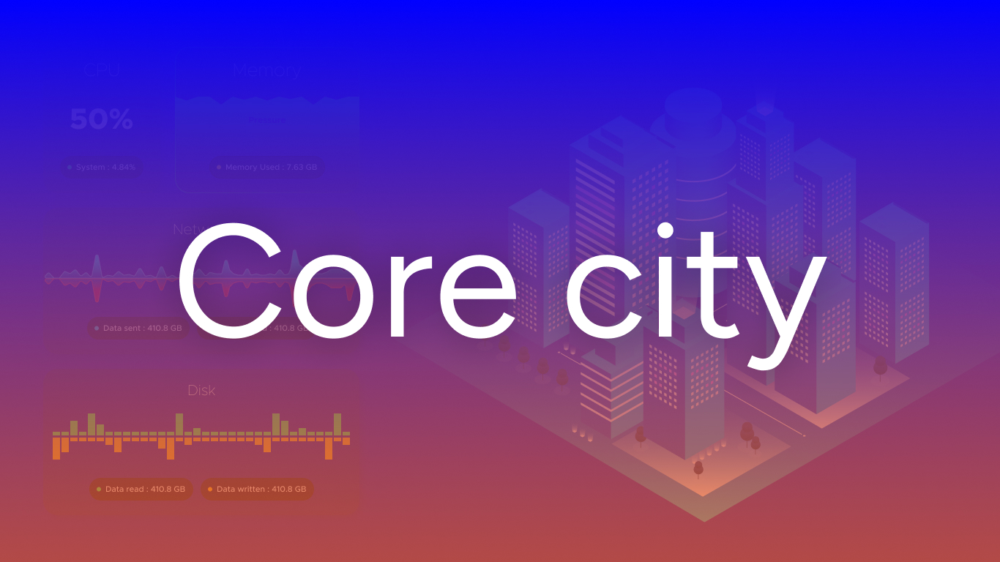

<h1 align="center">
  
</h1>

<br>

<p align="center">
  The backend system is an intangible world that processes complex and diverse tasks.
  <br>
  Suddenly, I thought "Wouldn't it be interesting to represent this world in a visible form?"
  <br>
  In this city, each server and database are represented as buildings
  <br>
  with the flow of data and tasks depicted as roads and vehicles.
  <br>
  Observe your own Core City and understand the status and performance of the Backend system!
</p>

<br>

<div align="center">
  
</div>

## Available Languages

- [한국어](README.ko.md)
- [English](README.md)

## Contents

- [Overview](#overview)
- [Key features & Technology Stack](#key-features--technology-stack)
  - [3D Visualization](#1-3d-visualization)
  - [Real-time Monitoring](#2-real-time-monitoring)
  - [Multi-user Collaboration](#3-multi-user-collaboration)
- [Demonstration](#demonstration)
- [Challenges & Leaning](#challenges--leaning)
  - [Data modeling and Relationship setting](#data-modeling-and-relationship-setting)
  - [Understanding and Using Prometheus and node_exporter](#understanding-and-using-prometheus-and-node-exporter)
  - [Designing RESTful API](#designing-restful-api)
  - [Managing Authentication Information and Tokens on the Client Side](#managing-authentication-info-and-tokens-on-client-side)
  - [Visualizing Server Monitoring Data with Three.js](#threejs-server-monitoring-visualization)
  - [AWS Deployment and Configuration in a Production Environment](#aws-deployment-and-configuration-in-production)
- [Results & Achievements](#results--achievements)
- [Installation and Running Instructions](#installation-and-running-instructions)
  - [Frontend](#installation-frontend)
  - [Backend](#installation-backend)

## Overview

**Background**:

I had an experience working on server monitoring at an IT company. Being an art student at the time, technical terms like servers and databases were unfamiliar to me. The work was relatively simple. My primary task was to check that the servers were functioning properly after the office staff had left for the day. The server monitoring service we used was a great help in my work. It featured an animation of water droplets falling from top to bottom, and if this animation stopped, I knew there was a problem with the server, allowing me to contact the person in charge.

**Project Goals and Motivation**:

The main goal of the Core City project is to provide a platform that visualizes the various information and statuses of backend systems through a 3D virtual city, allowing not only developers but also non-experts to intuitively understand and monitor the system's state. Through this project, users will be able to grasp the status and performance of servers at a glance by observing the height of buildings and the circulation of vehicles on the roads. Additionally, real-time monitoring and multi-user collaboration features enable efficient system management and problem-solving on a team basis. I believe this project plays a crucial role as a portfolio demonstrating my technical skills and problem-solving abilities through a creative approach to solving complex technical issues.

<br>

## Key features & Technology Stack

The Core City project provides a platform that allows for an intuitive understanding of complex backend systems through data visualization and real-time data processing. To achieve these objectives, we carefully selected a technology stack that enhances and supports the project's key functionalities, considering factors such as performance in production environments, future scalability, development efficiency and ecosystem support, security and reliability, and user experience. This section introduces the major features implemented in the project, the technologies chosen to realize these features, and the rationale behind the selection of each technology.

### 1. 3D Visualization

**Feature Overview**: The project provides visualization through 3D models of server infrastructure, enabling users to intuitively understand it. Users can easily grasp the status and performance of servers by observing the heights of buildings and the circulation of vehicles on roads.

**Technology Used**: [Three.js](https://threejs.org/)

**Selection Rationale**:

-Three.js is a 3D graphics library based on [WebGL](https://developer.mozilla.org/ko/docs/Web/API/WebGL_API) and written in [JavaScript](https://developer.mozilla.org/ko/docs/Web/JavaScript). The Core City project aims for visualization within a web platform and is developed using [React](https:/react.dev/), which offers the advantage of easy integration between the library and the framework.

<br>

### 2. Real-time Monitoring

**Feature Overview**: Users can monitor the status and performance of their servers in real-time. This capability ensures high availability and stability by enabling immediate detection and response to any server status or performance issues.

**Technology Used**: [Socket.IO](https://socket.io/), [Prometheus & node_exporter](https://prometheus.io/), [Chart.js](https://www.chartjs.org/)

**Selection Rationale**:

-Real-time server monitoring with Socket.IO enhances the reliability and availability of the service through bidirectional communication and automatic reconnection, ensuring compatibility across various browsers and devices, and easing development.

-The combination of Prometheus and node_exporter provides powerful tools for system monitoring and performance analysis. Prometheus's time-series data model and complex analysis capabilities through PromQL, along with node_exporter's collection of extensive system metrics such as CPU, memory, and disk usage, enable outstanding service discovery and automatic target updates in dynamic infrastructure environments.

-Real-time monitoring data visualization with Chart.js allows for intuitive understanding of complex performance metrics, offering excellent user interaction and compatibility. Its lightweight and highly customizable nature enables developers to flexibly build and manage systems, effectively supporting real-time data analysis and monitoring.

<br>

### 3. Multi-user Collaboration

**Feature Overview**: Team members can collaboratively monitor the system's status and swiftly address issues, facilitating efficient decision-making and rapid response.

**Technology Used**: [Firebase Google Authentication](https://firebase.google.com/)

**Selection Rationale**:

-Firebase Google Authentication offers easy login and high security for users, and by utilizing authentication information, it enables the distinction between regular users and admin users, as well as the introduction of team concepts, thus allowing for effective permission management and team-based collaboration. This enhances accessibility in the real-time server monitoring system and increases the overall system's productivity through structured user management.

<br>

## Demonstration

**Demo site**: https://core-city.net/

<br>

<div align="center">
  
  <p><em>3D modeling and real-time monitoring demo</em></p>
</div>

<br>

<div align="center">
  
  <p><em>Multi-user collaboration demo</em></p>
</div>

<br>

## Challenges & Leaning

During the Core City project, I faced various technical challenges and experienced many small successes and failures in the process of addressing these challenges. This entire process allowed me to accumulate valuable experience. Below are the contents of the most memorable and significant challenges encountered during the project.

<details>
  <summary id="data-modeling-and-relationship-setting">Data modeling and Relationship setting</summary>

In the backend development process of the Core City project, managing user information (User) and server address (ServerAddress) documents effectively, and clearly defining the relationship (UserServerRelation) between them, provided me with an excellent opportunity to learn a new approach to modeling, having only created simple data models before. Particularly, designing the relationship schema for managing and setting relationships between documents was a key element in ensuring data integrity and accessibility.

<br>

<div align="center">
  
  <p><em>Schema Modeling</em></p>
</div>

<br>

**Learning Points and Solutions**:

**Normalized Data Model Design**: To efficiently represent the relationship between users and server addresses, each entity was defined in a separate schema. This minimized data duplication and enhanced the efficiency of updates and management.

**Relational Schema Definition**: The UserServerRelation schema implemented a many-to-many (N:N) relationship between users and server addresses. This schema references user IDs and server address IDs and includes additional relationship information, such as user approval status and whether they are administrators.

**Ensuring Data Integrity and Accessibility**: By using MongoDB's reference (ref) to manage relational data, data integrity was maintained, and efficiency was guaranteed when querying related data. Additionally, the populate() method was set up to easily retrieve the results of relational queries.

**Security and Permission Management**: In UserServerRelation, managing whether users are authorized to access servers and their administrative rights strengthened the application's security. This allowed for more detailed control over the servers users could access and the actions they could perform.

Through my experience in data modeling and relationship establishment, I have developed the ability to effectively construct schema models that go beyond simple schema modeling and involve closely related schemas. Furthermore, I have come to understand the importance of data integrity, realizing that accurately setting it up in the early stages is a key factor in avoiding extensive logic modifications throughout the entire project. This experience has greatly aided in the efficient progression and maintenance of the project.

</details>

<br>

<details>
  <summary id="understanding-and-using-prometheus-and-node-exporter">Understanding and Using Prometheus and node_exporter</summary>

During the development of the Core City project's real-time monitoring system, I decided to implement Prometheus and node_exporter to collect and analyze performance metrics from the backend servers. These technologies provide powerful monitoring capabilities, but there were several challenges in initial setup, understanding the method of metrics collection, and data querying.

**Learning Points and Solutions**:

**Understanding Initial Setup and Configuration**: The initial installation and configuration process for Prometheus and node_exporter was somewhat complex. By referring to official documentation and community guides, I familiarized ourselves with the necessary software installation and execution methods. Particularly, I learned how to define which data to collect and how frequently through the configuration of the Prometheus server's configuration file `prometheus.yml`.

```yml
global:
  scrape_interval: 10s # Set the scrape interval to every 15 seconds. Default is every 1 minute.
  evaluation_interval: 10s # Evaluate rules every 15 seconds. The default is every 1 minute.
  # scrape_timeout is set to the global default (10s).
```

_The default setting is every 15 seconds, but I adjusted the scrape and evaluation intervals to 10 seconds to align with the project's intentions._

```yml
scrape_configs:
  # The job name is added as a label `job=<job_name>` to any timeseries scraped from this config.
  - job_name: "prometheus"

    # metrics_path defaults to '/metrics'
    # scheme defaults to 'http'.

    static_configs:
      - targets: ["localhost:9100"]
        labels:
          group: "server-monitor"
```

_In the prometheus.yml content, I reassigned the scrape target to the 9100 port, where node_exporter is running, and designated a group name._

**Understanding Metric Collection Methods**: It took time to understand how to collect various performance metrics (such as CPU usage, memory usage, disk I/O, etc.) through node_exporter. By learning about Prometheus's metric collection mechanism and the types of metrics provided by node_exporter, I developed a method to effectively monitor the necessary performance indicators.

```javascript
const totalMemoryQuery =
  address === "http://localhost:9090/"
    ? `node_memory_total_bytes`
    : `node_memory_MemTotal_bytes`;
const memoryUsedQuery =
  address === "http://localhost:9090/"
    ? `(node_memory_total_bytes - node_memory_free_bytes) / node_memory_total_bytes * 100`
    : `(node_memory_MemTotal_bytes - node_memory_MemFree_bytes) / node_memory_MemTotal_bytes * 100`;
const swapUsedQuery =
  address === "http://localhost:9090/"
    ? `node_memory_swap_used_bytes`
    : `node_memory_SwapTotal_bytes - node_memory_SwapFree_bytes`;
const memoryFreeQuery =
  address === "http://localhost:9090/"
    ? `node_memory_free_bytes`
    : `node_memory_MemFree_bytes`;
```

_Queries related to memory data collection in the project's backend (considering that queries may differ depending on the development or production environment)._

**PromQL**: The process of learning to use PromQL, Prometheus's query language, to extract and analyze useful information from collected data was particularly challenging. Through various PromQL examples and documentation, I learned basic querying methods and how to write complex queries that meet the project's requirements.

Through these challenging processes, I not only built the capability to establish a performance monitoring system using Prometheus and node_exporter but also gained a deep understanding of system performance analysis. This experience was greatly beneficial in expanding my knowledge and skills in system monitoring and performance optimization, beyond frontend and backend development.

</details>

<br>

<details>
  <summary id="designing-restful-api">Designing RESTful API</summary>

To support real-time data processing and multi-user collaboration features in the Core City project, designing a RESTful API for efficient data exchange with the backend system was essential. The design process of the RESTful API involved solving several complex issues such as representation of data resources, state transfer between client and server, and API version management.

**Learning Points and Solutions**:

**Resource Design and URI Structure**: First, I identified the project's key data resources, such as server status information, user authentication data, and visualization settings. By designing semantically clear and consistent URI structures for each resource, I enhanced the usability and understandability of the API.

**Proper Use of HTTP Methods and Status Codes**: For each API endpoint, I appropriately used HTTP methods (GET, POST, PUT, DELETE) to perform CRUD operations on resources. Additionally, I utilized HTTP status codes (e.g., 200 OK, 404 Not Found, 500 Internal Server Error) to clearly convey the results of API calls to the client.

**Version Managemen**t: I included version numbers in the URI paths to ensure the flexibility of supporting previous versions of the API while also adding new features, allowing for continuous improvement and expansion of the API.

**Security and Authentication**: Security was a critical consideration in the data transmission process through the RESTful API. By managing user authentication and authorization with Firebase and Google Authentication middleware, I implemented secure data transmission and access control.

Through this process, I was able to design and implement a robust and scalable RESTful API that supports the core functions of the Core City project. The RESTful API design process provided me with a deep understanding of REST architecture principles and the ability to devise better API design and security strategies.

</details>

<br>

<details>
  <summary id="managing-authentication-info-and-tokens-on-client-side">Managing Authentication Information and Tokens on the Client Side</summary>

In the Core City project, maintaining and securely managing user authentication information and tokens on the client side was a significant challenge. Specifically, there was a need to globally manage the application's state while ensuring security. My main challenge was to effectively manage the authentication state and ensure secure communication with the server using authentication tokens.

**Learning Points and Solutions**:

**State Management with Redux**: I used Redux to centrally manage user authentication states across various components of the application. This allowed me to access and update the authentication state anywhere within the application.

```javascript
import useAuthState from "@/hooks/useAuthState";

function App() {
  useAuthState();
  .
  .
  .
}
```

**Using Custom Hooks**: I implemented logic for storing, updating, and deleting authentication tokens in a reusable form using React's custom hooks feature. These custom hooks played a central role in handling various scenarios that could arise during the authentication process.

```javascript
const useAuthState = () => {
  const auth = getAuth(app);
  const dispatch = useDispatch();

  useEffect(() => {
    const unsubscribe = auth.onAuthStateChanged(async (user) => {
      if (!user) {
        dispatch(clearUser());

        return;
      }

      const token = await user.getIdToken();
      const result = await getUserInformation(token);

      if (result.error) {
        console.error(result.error);

        return;
      }

      dispatch(
        setUser({
          id: result._id,
          email: result.email,
          name: result.name,
          uid: result.uid,
          token: token,
        }),
      );
    });

    return () => unsubscribe();
  }, [dispatch]);
};
```

**Authentication State Verification at App Initialization**: I implemented logic in App.jsx to verify the validity of user authentication information and tokens at the application's initialization. This ensured that the authentication state was kept up to date whenever users accessed the application.

**Enhancing Security**: To securely manage user authentication information and tokens on the client side, I applied security best practices such as encrypted communication through HTTPS and token-based authentication methods.

This approach was an effective solution for efficiently managing user authentication information and tokens while enhancing security. Managing authentication information on the client side can be complex, but by utilizing Redux and custom hooks, I was able to resolve this complexity and smoothly manage the authentication process.

</details>

<br>

<details>
  <summary id="threejs-server-monitoring-visualization">Visualizing Server Monitoring Data with Three.js</summary>

Creating animation logic that assigns appropriate movement to each server monitoring data in 3D visualization with Three.js was a challenging task. Implementing natural movements for each object based on real-time changing data required meticulous animation adjustments and performance optimization.

**Learning Points and Solutions**:

**Incremental Development Approach**: To manage the complexity of initial settings, I started with small features and progressively developed the project. This allowed me to gradually build the complex system, identifying and solving problems early on.

**Learning the Basics of Animation**: I studied the basic principles of animation and various techniques such as loop animations with Three.js. This was essential knowledge for effectively visualizing the dynamic characteristics of data.

**Designing Animations with Performance in Mind**: When implementing animations, I had to consider the performance and limitations of the browser. Therefore, I applied methods to minimize unnecessary resource usage and represented objects at a suitable ratio compared to their original values. If the data values did not change or the range was not wide, I maintained the previously created objects.

**Developing Data-Based Animation Logic**: To reflect the real-time changes in server monitoring data, I developed animation logic that varied the number of objects, their heights, etc., based on data values. For example, I added interactive elements such as increasing the number of vehicles on the roads according to traffic volume or adjusting the height of buildings based on server load conditions.

Implementing 3D visualization of server monitoring data with Three.js provided an opportunity for technical challenge and growth as a developer. The deep technical understanding and problem-solving abilities I gained through this process will be a significant asset when facing similar challenges in the future.

</details>

<br>

<details>
  <summary id="aws-deployment-and-configuration-in-production">AWS Deployment and Configuration in a Production Environment</summary>

Transitioning the project from a local development environment to a production environment involved several complex steps. Notably, setting up ELB (Elastic Load Balancing) and EC2 (Elastic Compute Cloud) instances for secure communication via HTTPS in the production environment, issuing SSL/TLS certificates, and setting security policies presented challenges different from developing logic. Additionally, setting up a virtual user server for demo purposes and writing scripts to run Prometheus within the server was a new experience.

**Learning Points and Solutions**:

**Setting up HTTPS Communication**: To ensure secure communication in the production environment, I set up ELB and configured load balancers for EC2 instances. This process involved not only opening HTTPS ports and setting related security policies via the load balancer but also understanding how the introduction of load balancers naturally supports high availability.

**Configuring Virtual User Servers**: To run Prometheus in an EC2 instance environment, not locally, I wrote scripts to operate and manage Prometheus within the instance. These scripts were configured to automatically execute the Prometheus service upon server startup, ensuring the continuous operation of the monitoring system.

**Incremental Implementation**: I started by manually deploying the application on a basic EC2 instance. Gradually, I built an automated CI/CD pipeline and integrated more advanced services to optimize the deployment process.

**Focusing on Security Settings**: I carefully configured the necessary security settings to safely deploy the application on AWS. This involved setting IAM roles and policies to apply the principle of least privilege and isolating the network through VPC.

Through this process, I gained a deep understanding of how to successfully deploy and manage web applications using AWS cloud infrastructure. Additionally, I gained practical experience in automating and optimizing deployment using cloud services and in managing security.

</details>

<br>

## Results & Achievements

**Technical Growth**: Through the Core City project, I gained a deep understanding of technologies such as 3D visualization, real-time data processing, and RESTful API design. The experience of independently developing a monitoring solution for a complex system by integrating these technologies significantly enhanced my capabilities as a developer.

**Problem-Solving Skills**: By independently resolving various technical challenges encountered during the project development process, I developed the ability to analyze complex problems and derive efficient solutions. In particular, efforts to optimize performance and improve the intuitiveness of the user interface contributed to enhancing the quality and user experience of the project.

**Creative Approach**: The creative idea of visualizing the complexity of backend systems as a 3D virtual city distinguished it from existing monitoring tools. This approach made it easier for non-developers to understand the state of the system, thereby increasing the accessibility of the monitoring solution.

## Installation and Running Instructions

<details>
  <summary id="installation-frontend">Frontend</summary>

**Environmental Requirements**

- Node.js v18.18.1 or higher
- npm v9.8.1 (installed along with Node.js)

**Installation Procedure**

**Project Clone**

```bash
git clone https://github.com/project-CoreCity/Frontend.git
```

**Installation of Dependencies**

```
npm install
```

Create a .env file in the project root directory.

```bash
VITE_BACKEND_URL=http://localhost:3000 # The default port for the project's backend is 3000.

# The area below is where you enter the information you received from Firebase.

VITE_FIREBASE_API_KEY=
VITE_FIREBASE_AUTH_DOMAIN=
VITE_FIREBASE_PROJECT_ID=
VITE_FIREBASE_STORAGE_BUCKET=
VITE_FIREBASE_MESSAGING_SENDER_ID=
VITE_FIREBASE_APP_ID=
VITE_FIREBASE_MEASUREMENT_ID=
```

**Execution Commands**

Development mode

```bash
npm run dev
```

Production mode

```bash
npm run build
```

</details>

<br>

<details>
  <summary id="installation-backend">Backend</summary>

**nvironmental Requirements**

- Node.js v18.18.1 or higher
- npm v9.8.1 (installed along with Node.js)

**Installation Procedure**

**Project Clone**

```bash
git clone https://github.com/project-CoreCity/Backend.git
```

**Installation of Dependencies**

```
npm install
```

Create a .env file in the project root directory.

```bash
CONNECTION_URI= # 여러분의 MongoDB Connection String을 입력해주세요.

FRONTEND_URL=http://localhost:5173 # The default port for the project's frontend is 5173.

# The area below is where you enter the information you received from Firebase.
# The FIREBASE_PRIVATE_KEY_ID value is very long, so pay attention to proper line breaks.
# Considering the AWS deployment for the Core City project, use @ instead of \n, and then use .replace(/@/g, "\n") in the code to handle line breaks.

FRONTEND_URL=
FIREBASE_TYPE=
FIREBASE_PROJECT_ID=
FIREBASE_PRIVATE_KEY_ID=
FIREBASE_PRIVATE_KEY=
FIREBASE_CLIENT_EMAIL=
FIREBASE_CLIENT_ID=
FIREBASE_AUTH_URI=
FIREBASE_TOKEN_URI=
FIREBASE_AUTH_PROVIDER_CERT_URL=
FIREBASE_CLIENT_CERT_URL=
FIREBASE_UNIVERSE_DOMAIN=
```

**Execution Commands**

Development mode

```bash
npm run dev
```

</details>

---

Copyright (c) 2024 Core City project.
